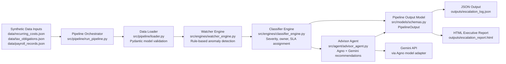

# High-Level Architecture

```mermaid
flowchart LR
    A["Synthetic Data Inputs<br/>data/recurring_costs.json<br/>data/tax_obligations.json<br/>data/payroll_records.json"]
    B["Pipeline Orchestrator<br/>src/pipeline/run_pipeline.py"]
    C["Data Loader<br/>src/pipeline/loader.py<br/>Pydantic model validation"]
    D["Watcher Engine<br/>src/engines/watcher_engine.py<br/>Rule-based anomaly detection"]
    E["Classifier Engine<br/>src/engines/classifier_engine.py<br/>Severity, owner, SLA assignment"]
    F["Advisor Agent<br/>src/agent/advisor_agent.py<br/>Agno + Gemini recommendations"]
    G["Pipeline Output Model<br/>src/models/schemas.py<br/>PipelineOutput"]
    H["JSON Output<br/>outputs/escalation_log.json"]
    I["HTML Executive Report<br/>outputs/escalation_report.html"]
    J["Gemini API<br/>via Agno model adapter"]

    A --> B
    B --> C
    C --> D
    D --> E
    E --> F
    F --> J
    E --> G
    F --> G
    G --> H
    G --> I
```

